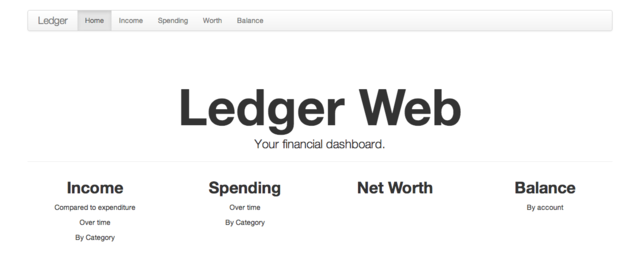
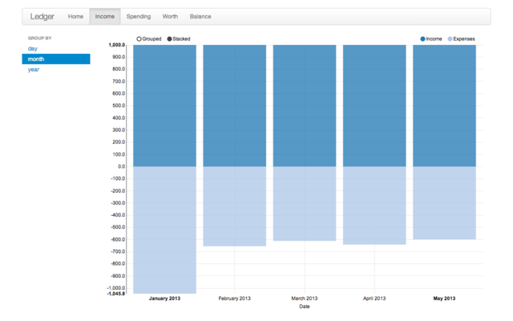
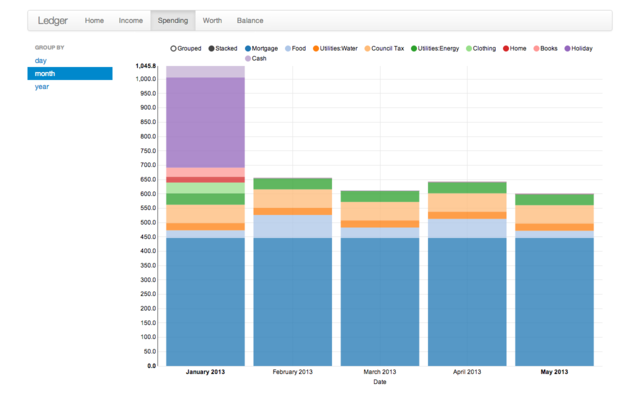
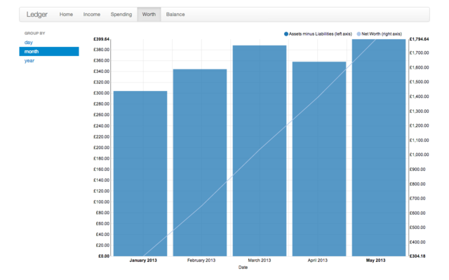
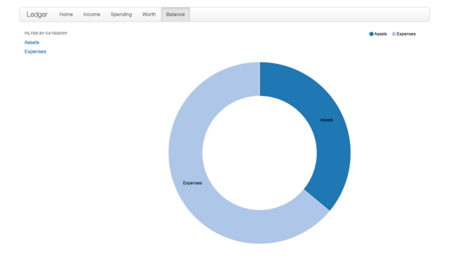

# ledger-web

Web front-end to access the Ledger command-line interface ([ledger-cli.org](http://ledger-cli.org/)).

> Ledger is a powerful, double-entry accounting system that is accessed from the UNIX command-line.

### Income

Income compared to expenditure over time (daily, monthly or yearly).

### Spending

Over time and grouped by expense (daily, monthly or yearly).

### Net Worth

Assets minus liabilities over time (daily, monthly or yearly).

### Balance

Breakdown of transactions, filterable by type.

## Dependencies

  * [Ledger 3](http://ledger-cli.org/)
  * [Node.js](nodejs.org) and npm

### Installing Ledger

The simplest way to install Ledger 3 is through [Homebrew](http://mxcl.github.com/homebrew/).

    brew install ledger --HEAD

The `--HEAD` option is required to install version 3.x.

## Usage

Clone the `node-ledger-web` git repository from GitHub.

    git clone https://github.com/slashdotdash/node-ledger-web.git

Install the dependencies with npm.

    cd node-ledger-web
    npm install

Bower is used to manage JavaScript and CSS dependencies. Install it and our dependencies

    npm install -g bower
    bower install

Grunt is used for building the front-end assets. Install grunt and run its default build task.

    npm install -g grunt-cli
    grunt

Finally, run the express application and open [http://localhost:3000/](http://localhost:3000/) in a web browser.

    node app.js

Two http servers will be started: One to listen on port 3000 for web requests, and one on port 3001 for API requests.

### Configuration

Copy and edit the sample config.

    cp sample-config.json config.json
    vim config.json

#### Binary

Specify the ledger binary path. Leave it as "ledger" if it's already on your `$PATH`. Otherwise, specify the absolute path.

#### File

Specify the path to your ledger file.

